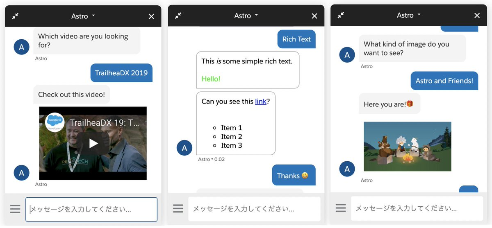

# Einstein Bots UI Recipe
Provides rich user interface by LWC `lightningsnapin-base-chat-message` base component in Salesforce Einstein Bot and Embedded Service for Web.

## How to use
Deploy `chatMessage` lightning web component to the org and select it as custom component in embedded service setting.

<kbd></kbd>

If a message in Einstein Bot starts with
* `RICH_TEXT:<RICH_TEXT_CONTENT_INCLUDING_SUPPORTED_HTML_TAGS>`, shows the message in rich text format.
* `YOUTUBE:<YOUTUBE_VIDEO_ID>`, shows the youtube video in chat window.
* `IMAGE:<IMAGE_URL>`, shows the image.
* `URL:<TARGET_URL>` shows the OGP info.
* `PLAIN_TEXT:<MESSAGE>` or no prefix, shows the message in plain text format.

## Example

## Notice
* When you use URL component, remote site setting is required. And text truncation is [not supported in Internet Explorer](https://developer.mozilla.org/en-US/docs/Web/CSS/-webkit-line-clamp).
* Custom attributes cannot be passed to lightning web component. So in this repository, using prefix rule to decide the type of content.
* Standard CSS selector is not applied to custom message component. Be careful for the layout skew.
* URL in bot message is automatically converted to string contains `<a>` tag. For example, if a bot message is `https://www.google.com`, in custom component, `messageContent.value` will be `<a href="https//www.google.com">https://www.google.com</a>`. So `extractOriginalString` method returns the original url without `<a>` tag.
